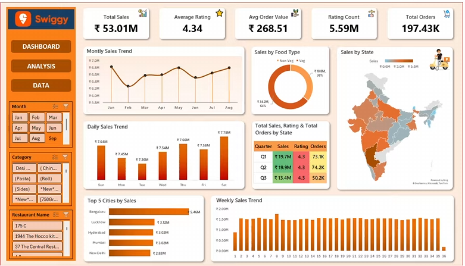

# Swiggy Sales Analysis & Dashboard

---

## What This Project Is About

I analyzed Swiggy's food delivery data to answer one real question —
where is the business actually performing, and where is it not?

This is not just charts. It combines Python-based data exploration
with an interactive Excel dashboard built from scratch to tell a
complete story about sales, customers, and regional trends.

---

## The Problem I Started With

Swiggy operates across hundreds of cities with thousands of 
restaurants. Without digging into the data, it is impossible to know
which cities drive revenue, which days spike orders, or whether 
customer satisfaction is holding up over time.

This project tries to answer exactly that.

---

## What the Data Showed

Total sales across the dataset came out to Rs. 53.01 Million
across 1,97,430 orders with an average order value of Rs. 268.51.
The platform maintained a 4.34 average rating across 5.59 Million
rated orders — which is remarkably consistent.

### Sales by Time :-

- Saturday recorded the single highest daily sales at Rs. 7.78M
- Monthly data shows steady growth from January through August
- 36 weeks of weekly data tracked with no major drop-off periods

### City Performance :-

- Bengaluru alone generated Rs. 5.46M — more than any other city
- Lucknow came second at Rs. 3.12M
- Hyderabad, Mumbai, and New Delhi followed closely between 
  Rs. 2.83M to Rs. 3.02M

### Food Type Split :-

- 64% of all orders were Non-Veg
- Veg orders made up the remaining 36%
- Non-veg consistently drove higher order values

### Quarterly Numbers :-

Q1 :- Rs. 19.7M in sales, 73,100 orders, 4.3 rating
Q2 :- Rs. 19.9M in sales, 74,200 orders, 4.3 rating  
Q3 :- Rs. 13.4M in sales, 50,200 orders, 4.3 rating

The rating held at 4.3 across all three quarters despite volume
changes — that tells something about operational consistency.

---

## What I Actually Built

Starting from raw data, I cleaned and explored everything in Python
using Pandas, Matplotlib, and Seaborn inside Google Colab.

From there I built the Excel dashboard manually — every chart,
every slicer, every layout decision was intentional. The dashboard
lets anyone filter by month, food category, and restaurant name
and watch every visual update in real time.

The India map visual was built using Bing Maps integration inside
Excel to show state-level sales distribution at a glance.

---

## Tools Used :-

Python, Pandas, Matplotlib, Seaborn, Google Colab,
Microsoft Excel, Pivot Tables, Slicers, Bing Maps

---

## Files in This Project :-

Swiggy_Analysis_Dashboard.xlsx :- Full interactive Excel dashboard
swiggy_sales_analysis.ipynb    :- Python EDA notebook
swiggy_data.xlsx               :- Raw dataset
swiggy_dashboard.png           :- Dashboard screenshot

---

## What I Took Away From This

The biggest realization was that 1 city out of hundreds accounts
for a disproportionate share of revenue. Bengaluru at Rs. 5.46M
versus New Delhi at Rs. 2.83M is not a small gap for a platform
that operates nationally.

The second thing was how stable the ratings were. 4.3 across
Q1, Q2, and Q3 despite order volumes dropping in Q3 suggests
that quality of service did not slip when demand slowed down.

These are the kinds of things the raw numbers do not tell you
until you actually sit with the data.

---

## 🗄️ SQL Analysis (Star Schema + KPI Queries)

While the Python and Excel work above focuses on exploration and visualization,
I also rebuilt this entire analysis in SQL Server from scratch — covering data
cleaning, schema design, and business KPI development.

### What I Built in SQL

**Data Cleaning**
- Null checks across all columns
- Blank/empty string detection
- Duplicate identification and removal using ROW_NUMBER()

**Star Schema Design**
Built a proper dimensional model with 1 fact table and 5 dimension tables:

| Table | Description |
|---|---|
| `fact_swiggy_orders` | Core transactional table with price, rating, foreign keys |
| `dim_date` | Year, Month, Quarter, Week, Day breakdown |
| `dim_location` | State → City → Location hierarchy |
| `dim_restaurant` | Restaurant master |
| `dim_category` | Food category master |
| `dim_dish` | Dish name master |

**KPIs Developed**

| KPI | Type |
|---|---|
| Total Orders & Revenue | Basic |
| Monthly / Quarterly / YoY Trends | Date-Based |
| Day-of-Week Order Patterns | Date-Based |
| Top 10 Cities by Volume | Location |
| Revenue Share by State | Location |
| Top Restaurants & Dishes | Food Performance |
| Cuisine Orders + Avg Rating | Food Performance |
| Customer Spend Buckets (Under 100 → 500+) | Spending |
| Ratings Distribution (1–5) | Ratings |

### SQL Files
- `01_data_cleaning.sql` — Null checks, duplicates, blank detection
- `02_schema_creation.sql` — Fact + dimension table creation
- `03_data_insertion.sql` — Populating all tables from raw data
- `04_kpi_queries.sql` — All business KPI queries

### Tools Used
SQL Server, T-SQL, Window Functions, CTEs, Star Schema Design
